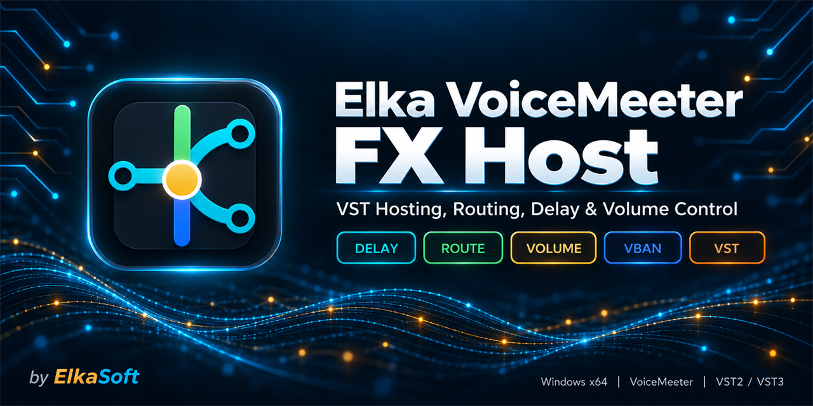

# Elka VoiceMeeter FX Host



Elka VoiceMeeter FX Host is a Windows control surface and VST host for
VoiceMeeter. It adds delay, volume, direct routing, VST processing, VST groups,
ASIO Patch operation, and VBAN-TEXT control without sending audio through a
separate DAW or plugin host.

The canvas is read from **left to right**:

```text
VoiceMeeter source -> VST or VST group -> VoiceMeeter destination
```

The important rule is simple: after a source is connected into a VST path, that
audio path is intentionally silent until the chain reaches a destination on the
right. This prevents an incomplete processing chain from leaking dry audio.

[Download the latest release](https://github.com/torment78/Elka.VoiceMeeterFxHost/releases/latest)

## Requirements

- Windows x64.
- VoiceMeeter installed and running.
- .NET 8 Desktop Runtime.
- VST3 plugins in the standard Windows VST3 folder or a custom folder added in
  the app.
- VST2 is available only in builds compiled with valid local VST2 SDK headers.

## Quick Setup

1. Start VoiceMeeter, then launch Elka VoiceMeeter FX Host.
2. Choose **Input**, **Output**, or **Main** for the VoiceMeeter callback area
   you want to work with.
3. Choose the hardware input, virtual input, or bus from the **I/O** section.
4. Open **VST / Route**.
5. Use **Scan** once, or add a custom plugin folder and scan it.
6. Add a VST by double-clicking it, dragging it to the canvas, or selecting it
   and pressing `Enter`.
7. Connect a left source pin to the VST input.
8. Connect the VST output to a right destination pin.
9. Repeat the route for the other channel when building a stereo chain.

For a normal stereo path, the finished graph looks like this:

```text
Source L/R -> VST input L/R -> VST output L/R -> Destination L/R
```

If sound disappears after the first cable, finish the cables on the right. That
silence is expected while the route is incomplete.

See the [complete user guide](docs/UserGuide.md) for scanning, groups,
multichannel pins, ASIO Patch, saves, tray behavior, and troubleshooting.

## Ctrl-Click Routing

Ctrl-click builds routes without dragging every cable:

1. Hold `Ctrl` and click a source endpoint on the left.
2. Ctrl-click VSTs on the canvas or VST names in the browser in the order they
   should process audio.
3. Ctrl-click a destination endpoint on the right.
4. Release `Ctrl` and press `Enter`.

The selected VSTs are grouped and wired in selection order. Selected endpoints
and VSTs stay highlighted until the action is completed. Press `Esc` to cancel.

Other supported combinations include:

- Ctrl-click only VSTs in the browser, then press `Enter`, to create an
  unattached VST group.
- Ctrl-click one or more sources and a VST, then press `Enter`, to connect the
  sources to that VST.
- Ctrl-click a VST and one or more destinations, then press `Enter`, to connect
  the VST outputs.
- Ctrl-click sources and destinations without a VST, then press `Enter`, to
  create direct endpoint cables.
- Ctrl-click an existing VST group and endpoints, then press `Enter`, to attach
  the group without rebuilding it.

The full selection rules and examples are in the
[Ctrl-click routing guide](docs/CtrlClickRouting.md).

## Main Features

- Per-channel delay from `0 ms` to `10,000 ms`.
- Per-channel volume from `0%` to `200%`, with `100%` as unity.
- Input, output, and main VoiceMeeter callback canvases.
- Direct endpoint routing and standard-route muting.
- VST3 scanning, custom plugin folders, native editors, state restore, reload,
  independent power, and independent bypass.
- VST groups with stable external connections while plugins are added,
  rearranged, powered, bypassed, or auto-wired inside the group.
- Stereo, multichannel, and sidechain pin layouts when supported by the plugin.
- Stable VST IDs and VBAN-TEXT commands for VST controls and exposed parameters.
- Callback mode and a separate VoiceMeeter Insert ASIO Patch mode.
- Saved layouts, **Save As**, **Load**, missing-plugin placeholders, remembered
  window size and position, startup delay, Start Tray, and Close to Tray.
- A custom **FX Host** button inside supported VoiceMeeter versions.

## Documentation

### Using The App

- [Complete user guide](docs/UserGuide.md)
- [Ctrl-click routing and quick groups](docs/CtrlClickRouting.md)
- [VBAN-TEXT and VFX commands](VFX_COMMANDS.md)
- [VST2 setup and scanning](docs/VST2Workflow.md)
- [Risks and current limitations](docs/RisksAndLimitations.md)

### Building And Development

- [Run the project in Visual Studio](docs/VisualStudioRun.md)
- [Build instructions](docs/BuildInstructions.md)
- [Publishing and GitHub releases](docs/Publishing.md)
- [Current architecture](docs/Architecture.md)
- [Dependencies](docs/Dependencies.md)
- [VoiceMeeter callback details](docs/VoiceMeeterCallbackAnalysis.md)
- [Realtime core status](docs/RealtimeCoreIsolation.md)
- [Plugin crash protection](docs/CrashProtectionRecommendation.md)

## Settings And Logs

Normal settings, plugin cache, saves, and logs are stored under:

```text
%LOCALAPPDATA%\ElkaSoft\VoiceMeeterFxHost
```

The in-app log shows callback status, plugin scanning, plugin loading, state
restore, cable changes, and ASIO Patch activity. Start there when a route or
plugin does not behave as expected.
