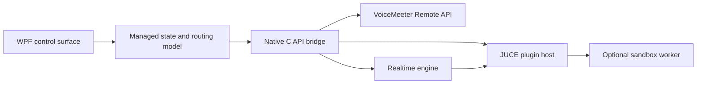

# Current Architecture

Elka VoiceMeeter FX Host is a WPF control application backed by native C++
audio, VoiceMeeter integration, and JUCE plugin hosting.

## Signal Paths

Normal callback operation:

```text
VoiceMeeter callback -> native realtime engine -> VST graph -> VoiceMeeter callback
```

ASIO Patch operation:

```text
VoiceMeeter Insert Virtual ASIO -> native realtime engine -> VST graph -> Insert ASIO
```

The two engine modes are mutually exclusive. Starting ASIO Patch disconnects
the normal VoiceMeeter callback before opening the Insert ASIO driver. Stopping
ASIO Patch returns ownership to the normal callback path.

## Application Layers



### WPF Control Surface

`src/app-wpf` owns:

- the main window, canvases, nodes, groups, cables, menus, and tray behavior
- plugin browser and scan progress
- save/load/export state
- VBAN-TEXT command parsing and dispatch
- plugin editor window requests
- non-realtime status and log presentation

The WPF layer does not process audio samples.

### Managed State And Routing

The managed model stores channel settings, endpoint layouts, VST nodes, VST
groups, stable VST IDs, cable definitions, plugin state, window placement, and
user preferences. UI changes are converted into compact native control updates.

The graph is directional. Endpoint sources are on the left, processing nodes are
in the middle, and destinations are on the right. A claimed but incomplete VST
path is silent until it reaches a destination.

### Native API Bridge

`src/native_api` exports the C interface consumed by WPF. It coordinates:

- VoiceMeeter login and callback registration
- Input, Output, and Main callback modes
- Insert ASIO probing, start, stop, and format handling
- realtime engine preparation and statistics
- plugin scan, load, state, parameter, editor, and worker operations

The released WPF app currently calls `ElkaVoiceMeeterFxHost.Native.dll`.

### Realtime Engine

`src/engine` owns the time-critical sample path:

- channel delay and gain
- direct routes and passthrough claims
- VST input/output routing
- VST group edge routing
- callback and ASIO block processing
- preallocated scratch and delay storage

Preparation occurs outside the callback. The callback avoids UI access, file
access, logging, plugin scanning, and avoidable allocation or locking.

### Plugin Host

`src/plugins` uses JUCE for VST discovery and hosting. It owns plugin instances,
bus layouts, state blobs, exposed parameters, programs, editors, bypass/power
state, and processing calls.

Normal plugins can run in the main host. Plugins matching known risky vendor
markers can run in the embedded `Elka.PluginWorker` process. The worker keeps
licensing and plugin faults away from the WPF UI process while shared audio and
control structures connect it to the native engine.

### VoiceMeeter Integration

`src/voicemeeter` dynamically loads the installed VoiceMeeter Remote API. The
engine registers one callback mode at a time and receives non-interleaved float
channel buffers owned and clocked by VoiceMeeter.

The custom VoiceMeeter **FX Host** button uses the Remote API custom-button
contract and sends a Windows command back to the WPF window.

## Persistence

User data is stored under:

```text
%LOCALAPPDATA%\ElkaSoft\VoiceMeeterFxHost
```

Saved state includes plugin cache, custom scan folders, channel controls,
routes, nodes, groups, cables, VST state, endpoint display settings, VBAN
settings, tray/startup settings, and window placement.

**Save As** exports a portable JSON representation. A missing plugin remains as
a visible placeholder so the graph can be repaired without losing its layout.

## Secondary Realtime Core

The build also produces `ElkaVoiceMeeterFxHost.RealtimeCore.dll`. It is a
JUCE-free experimental callback bridge and rollback/reference boundary. The
released WPF application does not currently select it as its backend. See
[Realtime Core Status](RealtimeCoreIsolation.md).

## Main Source Areas

- `src/app-wpf`: WPF UI and managed state
- `src/native_api`: primary native bridge
- `src/realtime_core_api`: secondary JUCE-free bridge
- `src/engine`: realtime processing
- `src/plugins`: JUCE VST host and sandbox transport
- `src/plugin-worker`: out-of-process plugin worker
- `src/voicemeeter`: VoiceMeeter Remote API integration
- `installer`: Inno Setup packaging
